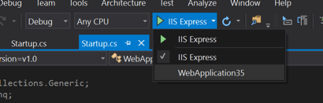

## Logging

## Setting up your application for logging
1. Use the application from the [Lab 2](2. Introduction to ASP.NET Core.md) (or setup steps from the Lab 2).
1. Navigate to `Startup.cs` and change the `Configure` method to:
    
    ```C#
        public void Configure(IApplicationBuilder app, IHostingEnvironment env, ILoggerFactory loggerFactory)
        {
            loggerFactory.AddConsole();

            var startupLogger = loggerFactory.CreateLogger<Startup>();
            ...
        }
    ```

1. Add a log statement to the end of the `Configure` method:
    
    ```C#
    public void Configure(IApplicationBuilder app, IHostingEnvironment env, ILoggerFactory loggerFactory)
    {
        ...
        startupLogger.LogInformation("Application startup complete!");
    }
    ```
    
1. In Visual Studio, change the active launch host to the application itself (self-host) by navigating to the play/run button and changing the drop-down to the entry named after the application. 

      

1. Run the application and browse to the application root (This will be `http://localhost:8081/` if you're continuing from Lab 2 code, or `http://localhost:5000` if you've started with a new project). You should see the default log messages from the framework as well as your custom log message in the console window.

## Filtering logs
1. Add a couple more logging statements to the `Configure` method:
    
    ```C#
    public void Configure(IApplicationBuilder app, IHostingEnvironment env, ILoggerFactory loggerFactory)
    {
        ...
        startupLogger.LogInformation("Application startup complete!");

        startupLogger.LogCritical("This is a critical message");
        startupLogger.LogDebug("This is a debug message");
        startupLogger.LogTrace("This is a trace message");
        startupLogger.LogWarning("This is a warning message");
        startupLogger.LogError("This is an error message");
    }
    ```
    
1. Change the minimum log level for the console logger in `Startup.cs`:

    ```C#
    public void Configure(IApplicationBuilder app, ILoggerFactory loggerFactory)
    {
        loggerFactory.AddConsole(LogLevel.Trace);
        ...
    }
    ```

1. Run the application and open a browser window with `http://localhost:8081/` as the address. You should see more verbose logging from the framework and startup including debug messages.

1. Change the application to only show logs from the Startup category:

    ```C#
    public void Configure(IApplicationBuilder app, ILoggerFactory loggerFactory)
    {
        loggerFactory.AddConsole((category, level) => category == typeof(Startup).FullName);
        ...
    }
    ```

1. Run the application and open a browser window with `http://localhost:8081/` as the address. You should only logs written by the Startup logger.

> **Note:** Completed code for this section is found [/Labs/Code/Lab4A](/Labs/Code/Lab4A).

## Adding other logging providers
1. Add references to the following Serilog NuGet packages:
   * "Serilog.Extensions.Logging"
   * "Serilog.Sinks.File"

1. Configure Serilog in `Startup.cs` to write to a file called `logfile.txt` in the project root (resolving usings for System.IO and Serilog):
    
    ```C#
    public Startup(IHostingEnvironment env)
    {
        Configuration = new ConfigurationBuilder()
                            .SetBasePath(env.ContentRootPath)
                            .AddJsonFile("appsettings.json")
                            .Build();

        var logFile = Path.Combine(env.ContentRootPath, "logfile.txt");

        Log.Logger = new LoggerConfiguration()
            .WriteTo.File(logFile)
            .CreateLogger();
    }
    ```
1. Add the Serilog provider in `Configure`:

    ```C#
    public void Configure(IApplicationBuilder app, IHostingEnvironment env, ILoggerFactory loggerFactory)
    {
      loggerFactory.AddConsole();
      loggerFactory.AddSerilog();
    
      var startupLogger = loggerFactory.CreateLogger<Startup>();        ...
    }
    ```

1. Run the application and open a browser window with `http://localhost:8081/` as the address. You should observe a file called `logfile.txt` appear in your application root. 

1. Close the conosle window and open the file, the application logs should be in there.

> **Note:** Completed code for this section is found [/Labs/Code/Lab4B](/Labs/Code/Lab4B).

## Extra 
1. Try adding more advanced filters with different levels.
1. Try configuring logging using the Configuration system (`IConfiguration`).

# Diagnostic pages

## Write some buggy code

1. Add a middleware to the above application that throws an exception. Your `Configure` method should look something like this:

    ```C#
    public void Configure(IApplicationBuilder app, ILoggerFactory loggerFactory)
    {
        loggerFactory.AddConsole();

        loggerFactory.AddSerilog();

        ...

        app.Run((context) =>
        {
            throw new InvalidOperationException("Oops!");
        });

        ...
    }
    ```
> **Note:** You can ignore the warning from Visual Studio recommending the use of awaitable code.

## Understanding the diagnostics middleware

1. Observe that the project contains a reference to the `Microsoft.AspNetCore.Diagnostics` NuGet package.

1. Observe that the `Configure()` method in `Startup.cs` includes a call to configure the developer experience middleware when running in the Development environment. Ensure that your new buggy code occurs after the exception page is wired up, as shown below:

    ```C#
    if (env.IsDevelopment())
    {
        app.UseDeveloperExceptionPage();
    }

    app.Run(async (context) =>
    {
        throw new InvalidOperationException("Oops!");
    });
    ```

1. Open the Project Properties dialog. On the Debug tab, ensure that the `ASPNETCORE_ENVIRONMENT` variable is set to "Development".

1. Run the application and open a browser window with `http://localhost:8081/` as the address. The debugger will break at the `InvalidOperationException`. If you type `F5` again to continue, you should see an application exception page in the browser.

## Adding an handler for non-development environments

1. Add exception handler middleware to the `Configure` method. Make sure it only runs when not in development:
    
    ```C#
    if (env.IsDevelopment())
    {
        app.UseDeveloperExceptionPage();
    }
    else
    {
        app.UseExceptionHandler(subApp =>
        {
            subApp.Run(async context =>
            {
                context.Response.ContentType = "text/html";
                await context.Response.WriteAsync("<strong> Application error. Please contact support. </strong>");
                await context.Response.WriteAsync(new string(' ', 512));  // Padding for IE
            });
        });
    }
    ```

1. Run the application in "Production" and open a browser window with `http://localhost:8081/` as the address. Type `F5` at the exception and you should see the custom error page instead of the exception.

> **Note:** Completed code for this section is found [/Labs/Code/Lab4C](/Labs/Code/Lab4C).

## Showing custom pages for non 500 status codes

1. Change the middleware throwing the exception message to instead set a 404 status code:

    ```C#
    app.Run((context) =>
    {
        context.Response.StatusCode = 404;
        return Task.FromResult(0);
    });
    ```
> **Note:** Make sure you get the change on the first line of this code block - we've removed the `async` keyword!

2. Add the status code pages middleware above the exception handler middleware in `Configure`:

    ```C#
    app.UseStatusCodePages(subApp =>
    {
        subApp.Run(async context =>
        {
            context.Response.ContentType = "text/html";
            await context.Response.WriteAsync($"<strong> You got a {context.Response.StatusCode}<strong>");
            await context.Response.WriteAsync(new string(' ', 512));  // Padding for IE
        });
    });
    
    ...
    ```
3. Run the application and open a browser window with `http://localhost:8081/` as the address. You should see the custom error page instead of the browser's default 404 page.

> **Note:** Completed code for this section is found [/Labs/Code/Lab4D](/Labs/Code/Lab4D).

## Extra
1. Access the exception when using the exception handler middleware, log it to the logging system. (**Note: The exception handler middleware does log the exception via the logging system.**)
2. Serve an html page when an exception occurs using the static files middleware and the exception handler middleware.
3. Serve an html page for a 404 status using the static files middleware and status code pages middleware.
4. Write a custom logging provider
